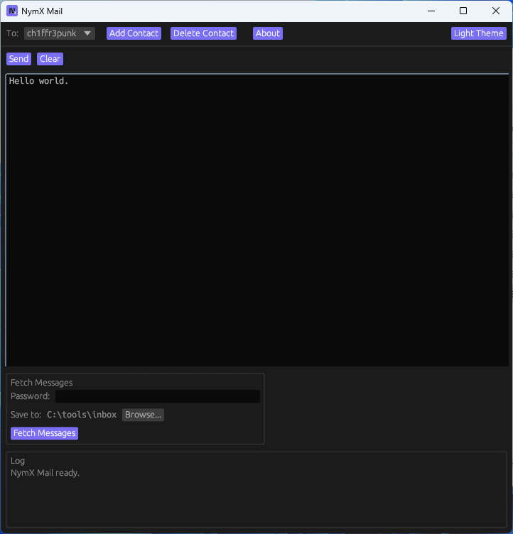

## NymX Mail

An easy-to-use text-only email client for the Nym Mixnet that is based on [NymX](https://github.com/Ch1ffr3punk/NymX).

Please note that NymX Mail uses SSH and the clearnet to retrieve emails, not the Nym Mixnet. If you want to use the Nym Mixnet for this purpose, I have added the official nym-proxy-client and nym-proxy-server. You can find the compiled versions under “Releases”.  



For support, please post your questions to the Usenet Newsgroup alt.privacy.anon-server.

If you regularly use NymX Mail, please consider making a donation in cryptocurrency or buying me a coffee.      
```
BTC: bc1qm0e7r94ht60tu7zuewf0ftl3td0xc700rvcagn
Nym: n1f0r6zzu5hgh4rprk2v2gqcyr0f5fr84zv69d3x          
```
<a href="https://www.buymeacoffee.com/Ch1ffr3punk" target="_blank"></a>

NymX Mail is dedicated to Alice and Bob.